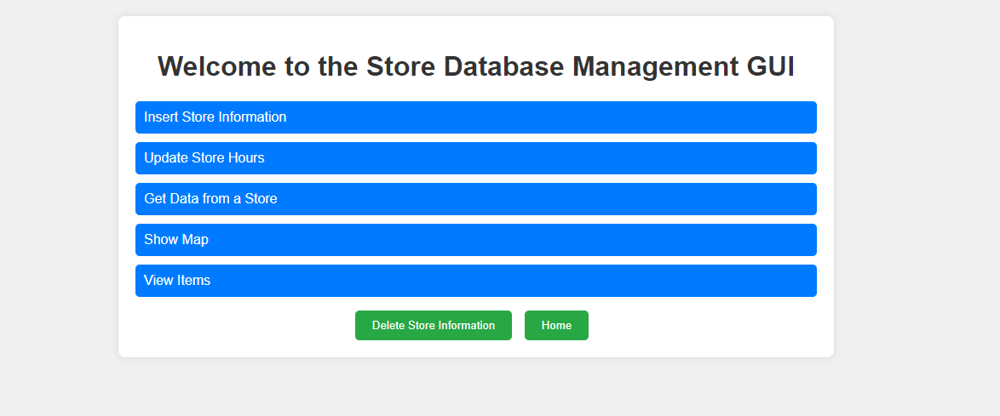
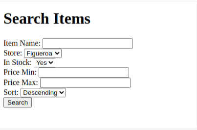
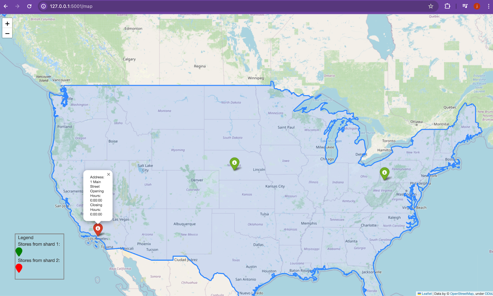

# **Retail Database Management System with Spatial Visualization**

## **Introduction**

This project was developed as part of a database systems course assignment to simulate a real-world retail database management system. The objective was to design a scalable solution for managing store locations, inventory, and customer queries while incorporating spatial visualization to aid decision-making for store managers.

The system includes:
- **Admin Tools**: CRUD functionality to manage store details and inventory, with spatial data visualization to identify optimal store locations.
- **Customer Tools**: A user-friendly interface to query available items based on name, availability, and price range.

This project bridges academic theory and practical application, resulting in a system capable of addressing challenges faced by fast-growing retail chains.

---

## **Features**

### **Admin Features**
1. **Manage Store Data**:
   - Add, update, delete, or fetch store details.
   - View store details and overlapping zones on an interactive map with spatial buffers.
2. **Manage Inventory**:
   - Add, update, or delete items in store inventories.
   - Query inventory for specific stores.
3. **Spatial Visualization**:
   - Use map buffers to identify potential overlaps between store locations.
   - Analyze new store placement using spatial data.

### **Customer Features**
1. **Query Inventory**:
   - Search for items by name.
   - Filter results by availability or price range (min/max).
   - Sort results in ascending or descending order.
2. **Simple and Intuitive UI**:
   - User-friendly interface designed for seamless navigation.

### **Scalable Database Design**
- **Central Database**: Stores global information for all stores.
- **Shards**: Divides data by `store_id` to improve performance and scalability.
- ACID compliance ensures data consistency across central and shard databases.

---

## **Project Structure**

```plaintext
project-root/
├── src/
│   ├── database/
│   │   ├── central_creation.py          # Central database setup
│   │   ├── shard_creation.py            # Shard database setup
│   │   └── config.py                    # Database connection settings
│   ├── interfaces/
│   │   ├── admin_interface.py           # Admin GUI using Tkinter
│   │   ├── customer_interface.py        # Customer interface using Flask
│   │   └── GUI.py                       # Admin GUI logic
│   ├── actions/
│   │   ├── admin_actions.py             # Admin-side business logic
│   │   └── customer_actions.py          # Customer-side business logic
│   ├── main.py                          # Entry point for launching interfaces
├── templates/                           # HTML templates for Flask
├── tests/                               # Unit tests
├── data/
│   ├── tables_creation.txt              # SQL schemas for tables
│   └── shapefiles/                      # Spatial data for map visualization
├── docs/
│   ├── README.md                        # Documentation
│   ├── setup_guide.md                   # Setup instructions
│   ├── architecture_diagram.png         # Architecture design
│   └── final_report.pdf                 # Project report
├── .gitignore                           # Ignore unnecessary files
├── requirements.txt                     # Python dependencies
└── LICENSE                              # License information
```

---

## **Setup Instructions**

### **Prerequisites**
- Install **MySQL** and **MySQL Workbench**.
- Install Python 3.8+.
- Install required Python libraries:
  ```bash
  pip install -r requirements.txt
  ```

### **Database Setup**
1. Run the central database creation script:
   ```bash
   python src/database/central_creation.py
   ```
2. Run the shard database creation script:
   ```bash
   python src/database/shard_creation.py
   ```

### **Running the Interfaces**
- **Admin Interface (Tkinter):**
  ```bash
  python src/interfaces/admin_interface.py
  ```
- **Customer Interface (Flask):**
  ```bash
  python src/interfaces/customer_interface.py
  ```

---

## **Demo**

[](https://youtu.be/YOUR_VIDEO_ID)

Click the thumbnail above to watch a walkthrough of the project's features.

---

## **Screenshots**

### Admin Interface


### Customer Interface


### Spatial Visualization


---

## **Tech Stack**
- **Backend**: Python (Flask, Tkinter)
- **Database**: MySQL (central and shard architecture)
- **Mapping**: GeoPandas, Folium
- **Frontend**: HTML templates (Flask)

---

## **Learning Outcomes**

Key lessons from this project include:
- The importance of database scalability and sharding.
- Integrating spatial visualization with data management.
- Developing user-friendly interfaces for both technical and non-technical users.

---

## **Future Scope**
1. **Enhanced Spatial Analysis**:
   - Implement site suitability analysis for new stores.
   - Optimize delivery routes using network analysis.
2. **Performance Improvements**:
   - Add caching for frequently queried data.
   - Explore dynamic sharding based on load balancing.
3. **New Use Cases**:
   - Adapt the system for hospitals, schools, or warehouses.

---

## **Contributors**
- **Christian Becker**: Project lead, admin/customer interface development.
- **John Hemmer**: Web GUI development, database integration.
- **Jesse Gallegos**: Code review, backend optimization.

---
